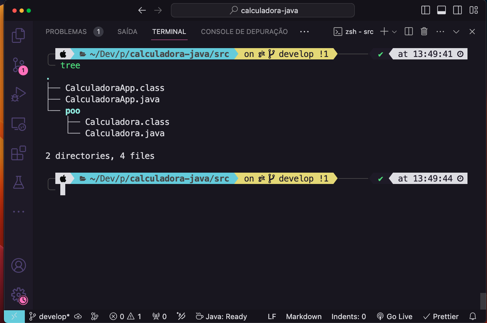
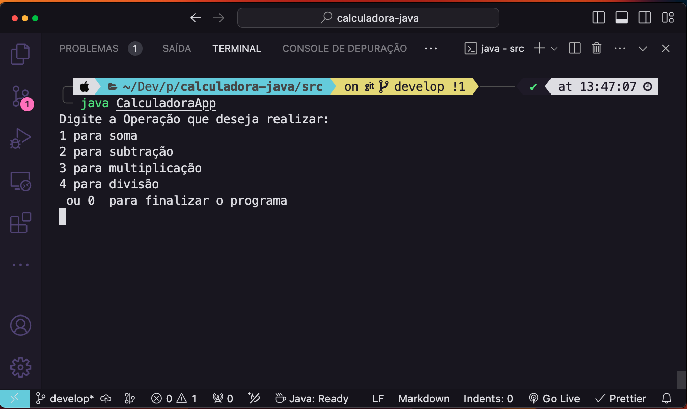
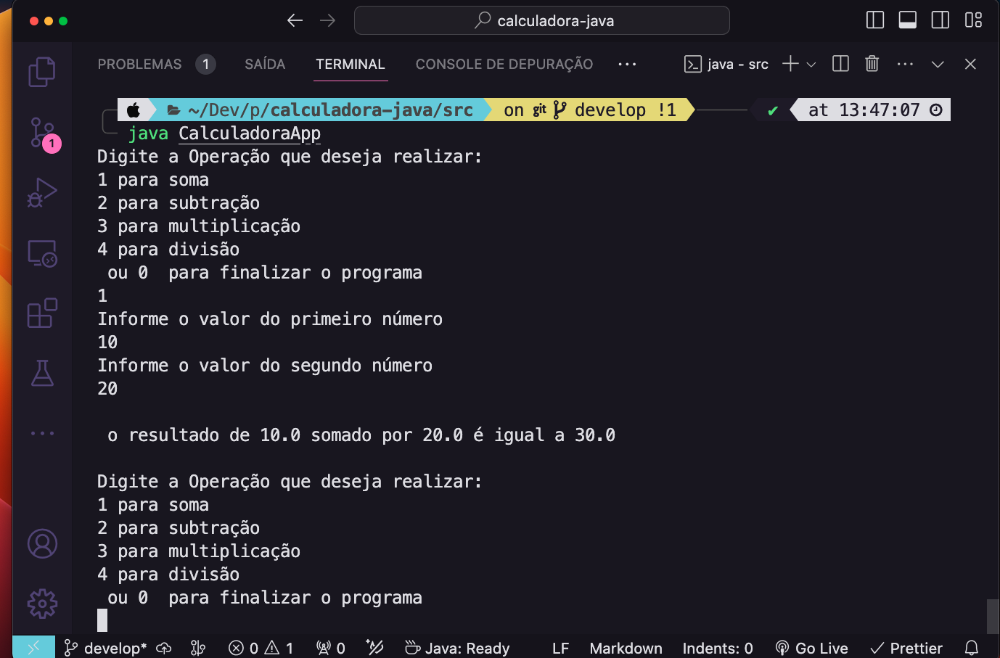

## Index

- [Getting Started](#-getting-started)
- [About](#-about)
- [Folder Structure](#-folder-structure)
- [Technologies used](#-🚀technologies-used)
- [Dependency Management](#-dependencies-management)
- [How to download the Project](#-how-to-download-the-project)
- [Execution](#execution)

## Project name: calculadora-java

## Getting Started

Welcome to the VS Code Java world. Here is a guideline to help you get started to write Java code in Visual Studio Code.

## About

<p>
The **JAVA Calculator** project was developed with the purpose of capturing the learning acquired at Faculdade Descomplica.
</p>

## Folder Structure

The workspace contains two folders by default, where:

- `src`: the folder to maintain sources
- `lib`: the folder to maintain dependencies

Meanwhile, the compiled output files will be generated in the `bin` folder by default.

> If you want to customize the folder structure, open `.vscode/settings.json` and update the related settings there.

---

## 🚀Technologies used

The project was developed using the following technologies

[JAVA](https://docs.oracle.com/en/java/)

---

## images





---

## Dependency Management

The `JAVA PROJECTS` view allows you to manage your dependencies. More details can be found [here](https://github.com/microsoft/vscode-java-dependency#manage-dependencies).

## 🗂️ How to download the project

```bash
# clone repository
$ git clone https://github.com/cabraldasilvac/calculadora-java

# enter directory
$ cd ~/javacalculator

# Install dependencies
$ yarn install

# Compile and Start the project
$ javac CalculadoraApp.java && java CalculadoraApp
```

## Execution

`java CalculadoraApp`
